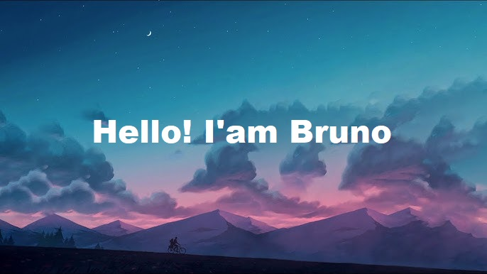

--

Hello! I'm Bruno, a student of Software Engineering, and this is my repository on GitHub. Here, you will find some of my personal projects as I strive to improve my skills by collaborating on different projects.

---

  <a href="https://github.com/brunomascioli">
  
   
  
  </a>

---

  <h2>Main skills</h2>
  
   
  
  

---

  <h2>Studying at the moment</h2>
  
  
  

